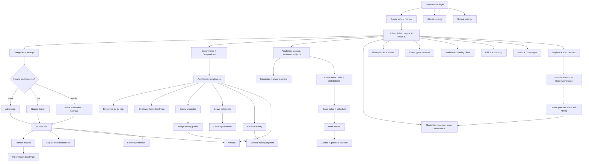

# Module documentation

Docs for each module implemented in the current SaaS School Management workflow.

**Full system flow (current + future update guide):** [`SYSTEM_WORKFLOW.md`](./SYSTEM_WORKFLOW.md)

All tenant-scoped APIs require:

```http
Authorization: Bearer {token}
X-Tenant-ID: {school-slug}
```

Super Admin school/tenant APIs typically omit `X-Tenant-ID` unless acting inside a school.

| # | Module | Doc |
|---|--------|-----|
| 1 | Authentication | [01-auth.md](./modules/01-auth.md) |
| 2 | Tenants & Schools | [02-tenants-schools.md](./modules/02-tenants-schools.md) |
| 3 | Student Admission | [03-student-admission.md](./modules/03-student-admission.md) |
| 4 | Online Admission | [04-online-admission.md](./modules/04-online-admission.md) |
| 5 | CSV Student Import | [05-student-import.md](./modules/05-student-import.md) |
| 6 | Student Categories | [06-student-categories.md](./modules/06-student-categories.md) |
| 7 | Student List (Student Details) | [07-student-list.md](./modules/07-student-list.md) |
| 8 | Deactivate Reason Master | [08-deactivate-reasons.md](./modules/08-deactivate-reasons.md) |
| 9 | Student Login Deactivate | [09-login-deactivate.md](./modules/09-login-deactivate.md) |
| 10 | Parents | [10-parents.md](./modules/10-parents.md) |
| 11 | Parent Login Deactivate | [11-parent-login-deactivate.md](./modules/11-parent-login-deactivate.md) |
| 12 | Employees (Dept / Designation / Staff / Login Deactivate) | [12-employees.md](./modules/12-employees.md) |
| 13 | Payroll (Salary Template / Assign / Payment) | [13-payroll.md](./modules/13-payroll.md) |
| 14 | Advance Salary & Leave | [14-advance-salary-and-leave.md](./modules/14-advance-salary-and-leave.md) |
| 15 | Awards | [15-awards.md](./modules/15-awards.md) |
| 16 | Academic | [16-academic.md](./modules/16-academic.md) |
| 17 | Exam Master | [17-exam-master.md](./modules/17-exam-master.md) |
| 18 | Grades & Positions (Marks) | [18-grades-and-positions.md](./modules/18-grades-and-positions.md) |
| 19 | Attendance | [19-attendance.md](./modules/19-attendance.md) |
| 20 | Library | [20-library.md](./modules/20-library.md) |
| 21 | Events | [21-events.md](./modules/21-events.md) |
| 22 | Student Accounting | [22-student-accounting.md](./modules/22-student-accounting.md) |
| 23 | Office Accounting | [23-office-accounting.md](./modules/23-office-accounting.md) |
| 24 | Messages / Mailbox | [24-messages.md](./modules/24-messages.md) |
| 25 | Global Settings | [25-global-settings.md](./modules/25-global-settings.md) |
| 26 | School Settings | [26-school-settings.md](./modules/26-school-settings.md) |
| 27 | Biometric Attendance (ZKTeco K40-H) | [27-biometric-zkteco.md](./modules/27-biometric-zkteco.md) |

## Typical end-to-end workflow



## Roles quick reference

| Role | Prefix | Typical access |
|------|--------|----------------|
| Super Admin | `superadmin` | All tenants, school provisioning |
| School Admin | `admin` | Full access within tenant |
| Teacher | `teacher` | Read list/detail; mark entries; positions; student attendance |
| Librarian | `librarian` | Library books + issue/return |
| Parent / Guardian | `parent` | Own profile + ward details |
| Student | `student` | Own profile; published exams; own attendance/issues |
