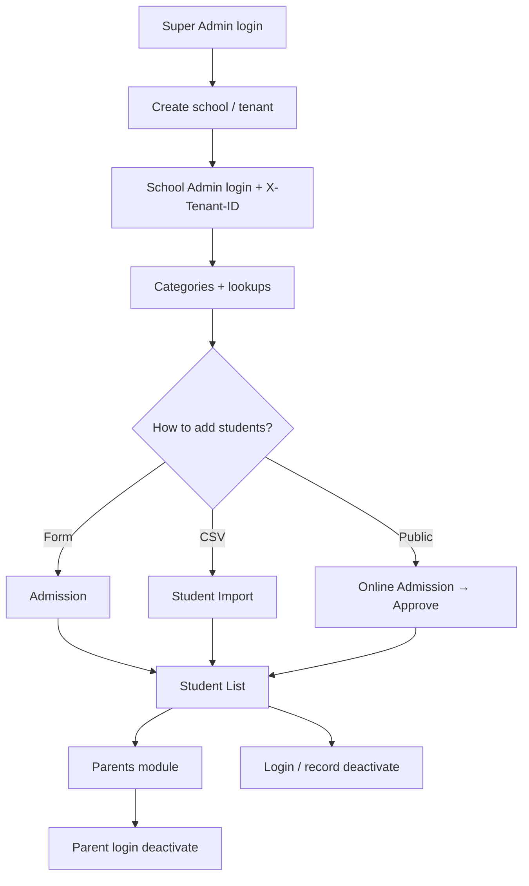

# Module documentation

Docs for each module implemented in the current SaaS School Management workflow.

**Full system flow (current + future update guide):** [`SYSTEM_WORKFLOW.md`](./SYSTEM_WORKFLOW.md)

All tenant-scoped APIs require:

```http
Authorization: Bearer {token}
X-Tenant-ID: {school-slug}
```

Super Admin school/tenant APIs typically omit `X-Tenant-ID` unless acting inside a school.

| # | Module | Doc |
|---|--------|-----|
| 1 | Authentication | [01-auth.md](./modules/01-auth.md) |
| 2 | Tenants & Schools | [02-tenants-schools.md](./modules/02-tenants-schools.md) |
| 3 | Student Admission | [03-student-admission.md](./modules/03-student-admission.md) |
| 4 | Online Admission | [04-online-admission.md](./modules/04-online-admission.md) |
| 5 | CSV Student Import | [05-student-import.md](./modules/05-student-import.md) |
| 6 | Student Categories | [06-student-categories.md](./modules/06-student-categories.md) |
| 7 | Student List (Student Details) | [07-student-list.md](./modules/07-student-list.md) |
| 8 | Deactivate Reason Master | [08-deactivate-reasons.md](./modules/08-deactivate-reasons.md) |
| 9 | Student Login Deactivate | [09-login-deactivate.md](./modules/09-login-deactivate.md) |
| 10 | Parents | [10-parents.md](./modules/10-parents.md) |
| 11 | Parent Login Deactivate | [11-parent-login-deactivate.md](./modules/11-parent-login-deactivate.md) |

## Typical end-to-end workflow



## Roles quick reference

| Role | Prefix | Typical access |
|------|--------|----------------|
| Super Admin | `superadmin` | All tenants, school provisioning |
| School Admin | `admin` | Full access within tenant |
| Teacher | `teacher` | Read list/detail on many modules |
| Parent / Guardian | `parent` | Own profile + ward details |
| Student | `student` | Own profile |
