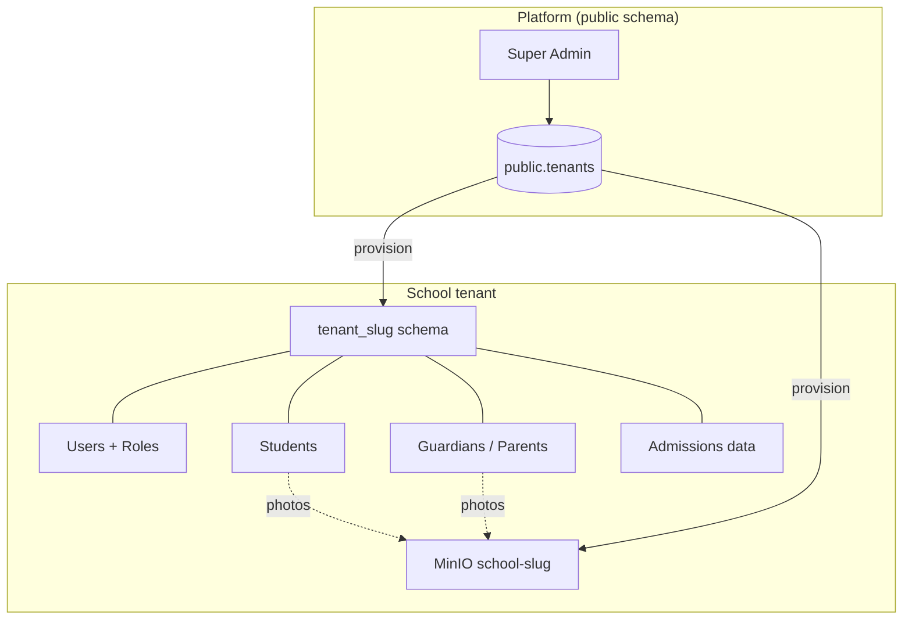
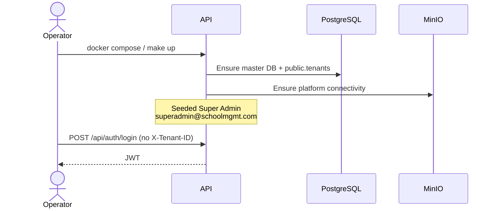
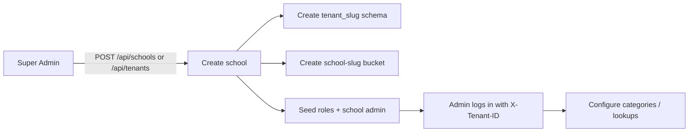
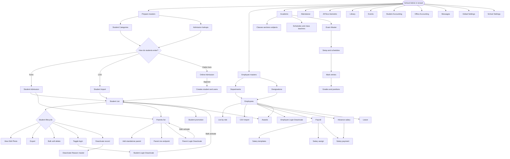
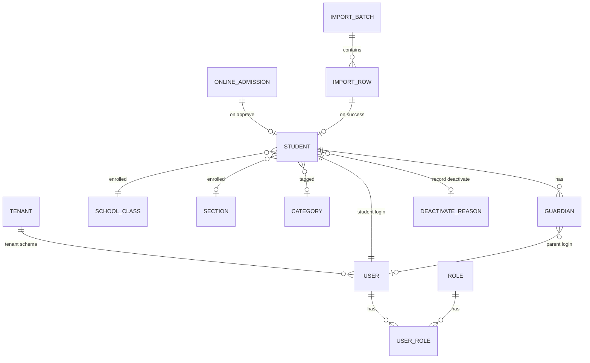

# System workflow (current)

> **Living document.** This describes the **currently implemented** end-to-end flow.
> When new modules ship, update this file and the [module index](./MODULES.md).

**Last updated:** 2026-08-10 · Modules 1–26 (Auth → School Settings)

---

## 1. Big picture



| Layer | What exists today |
|-------|-------------------|
| Platform | Super Admin auth, create/list schools & tenants, logos, settings, stats |
| Tenant data | Users, roles, classes, sections, categories, students, guardians, employees, departments, designations, online applications, import batches |
| Storage | Per-school MinIO bucket; student/guardian/employee/import objects + presigned URLs |
| Student lifecycle | Admission · Online admit · CSV import · List · Deactivate · Login deactivate |
| Parent lifecycle | Auto from admission · Standalone add · List · Login deactivate |
| Employee lifecycle | Departments · Designations · Add/import staff · Role-tab list · Login deactivate |
| Payroll | Salary templates · Assign grades · Monthly payment · My salary slip |
| HR requests | Advance salary · Leave categories · Leave applications · Awards |
| Academic | Classes · Sections · Subjects · Class teachers · Timetable · Promotion |
| Exam Master | Terms · Halls · Mark distributions · Exam setup · Schedules · Mark entries |
| Marks | Grade ranges · Generate / save exam positions |
| Attendance | Student · Employee · Exam attendance |
| Library | Categories · Books · Issue / return · Fine |
| Events | Event types · Events · Public list |
| Student Accounting | Fees types/groups · Allocation · Invoices · Offline payments · Reminders |
| Office Accounting | Voucher heads · Accounts · Deposits · Expenses · Transactions (Dr/Cr/running balance) |
| Messaging | Inbox · Sent · Important · Trash · Reply · Attachments |
| Settings | Global (platform) · School (per-tenant) · Payment gateways · Logos |

---

## 2. Bootstrap workflow (once per deployment)



**Steps**

1. Start stack (`make up` or local API + postgres/minio).
2. Open Swagger → login as Super Admin.
3. Create schools (next section).

---

## 3. School provisioning workflow



**After create**

| Artifact | Name pattern |
|----------|----------------|
| DB schema | `tenant_{slug}` |
| MinIO bucket | `school-{slug}` |
| Header for school APIs | `X-Tenant-ID: {slug}` |

School Admin (and later teachers/parents/students) always send **Bearer token + X-Tenant-ID**.

---

## 4. Overall operational flow (implemented)

> Mermaid node labels avoid `/api/...` paths — those break some Mermaid parsers (`[/text/]` is a shape).



---

## 5. Actor journeys (current)

### Super Admin

1. Login (no tenant header).
2. Create / activate / deactivate schools.
3. Upload logos, edit settings, view stats, export school list.
4. Optionally operate inside a school with `X-Tenant-ID`.

### School Admin

1. Login with `X-Tenant-ID`.
2. Maintain categories and use admission lookups.
3. Enroll students (admission / import / approve online apps).
4. Manage Student List (filter by class, search, export, deactivate).
5. Maintain deactivate reason labels.
6. Manage student & parent login deactivate queues.
7. Manage parents (add, photo, soft delete with sole-guardian guard).
8. Maintain departments / designations; add or CSV-import employees; manage employee login deactivate.
9. Manage payroll: salary templates, assign grades, process monthly payments (also Accountant).
10. Manage advance salary (also Accountant) and leave categories / applications.
11. Give awards to employees or students (also Accountant).
12. Manage academic structure (classes, sections, subjects, class teachers, schedules) and student promotion.
13. Manage exams: terms, halls, mark distributions, exam setup/publish, schedules, mark entries.
14. Manage grade ranges and generate/save exam positions.
15. Mark student / employee / exam attendance.
16. Manage library (categories, books, issue/return) and events (types, publish, website).
17. Manage student fees (types, groups, allocation, invoices, offline payments) and office accounts (deposits/expenses).
18. Configure school settings (general, student panel, payment gateways, logos); Super Admin also manages global settings.
19. Use mailbox to compose/reply/archive internal messages.

### Teacher

1. Read access: admissions list/detail, online admissions, student list, categories, parents list/detail.
2. Own employee profile: `GET /api/employees/me`.
3. Own salary: `GET /api/payroll/my-salary` (+ month slip).
4. Own HR: `/api/advance-salary/my`, `/api/leave/my`, `/api/awards/my`.
5. Academic: read subjects/schedules; own teacher schedule.
6. Exams: read schedules; submit mark entries; generate/save positions.
7. Student attendance for assigned classes; `GET /api/library/issues/my`.
8. No write on deactivate / import / parent or employee create (admin-only).

### Parent (Guardian)

1. Login with tenant header.
2. `GET /api/parents/me` — own profile + linked students.
3. View ward student details where authorized.

### Student

1. Login with tenant header.
2. `GET /api/student-list/me` — own profile.
3. Limited admission/list read of self.
4. Published exam schedules (`/api/exam/schedules`) and own marks when result is published.

### Public applicant

1. Load classes for school slug.
2. Submit online admission → track by reference number.
3. Waits for admin approve/decline/payment.

---

## 6. Data relationships (simplified)



---

## 7. Module map ↔ workflow stage

| Stage | Modules | Docs |
|-------|---------|------|
| Identity | Auth | [01-auth](./modules/01-auth.md) |
| Onboard school | Tenants & Schools | [02-tenants-schools](./modules/02-tenants-schools.md) |
| Masters | Categories, Lookups | [06](./modules/06-student-categories.md), [03](./modules/03-student-admission.md) |
| Ingest students | Admission, Online, Import | [03](./modules/03-student-admission.md), [04](./modules/04-online-admission.md), [05](./modules/05-student-import.md) |
| Operate directory | Student List | [07](./modules/07-student-list.md) |
| Exit / hold | Deactivate reasons, Login deactivate | [08](./modules/08-deactivate-reasons.md), [09](./modules/09-login-deactivate.md) |
| Family | Parents, Parent login deactivate | [10](./modules/10-parents.md), [11](./modules/11-parent-login-deactivate.md) |
| Public website | Frontend endpoints (home, about, staff, notices…) | [36](./modules/36-public-website.md) |

---

## 8. Not implemented yet (placeholders for future updates)

When these land, extend the diagrams above and add module docs:

| Area | Examples (planned / not in API yet) |
|------|-------------------------------------|
| Academics | Homework, report cards (exams/attendance: modules 17–19) |
| Fees | Advanced fee reports / gateway webhooks (core fees: module 22) |
| Library / Inventory | Assets beyond library books (library: module 20) |
| Transport ops | Live routes beyond lookup seed |
| Hostel ops | Allocation workflows beyond lookup |
| Messaging | SMS/email notifications, announcements (in-app mailbox: module 24) |
| Public CMS backend | Admin CRUD for website content (public GETs live: [36](./modules/36-public-website.md)) |
| Analytics | Dashboards beyond school stats |
| Mobile apps | Dedicated client apps |

**Update checklist when adding a feature**

1. Add `docs/modules/NN-name.md`
2. Link it in [`MODULES.md`](./MODULES.md)
3. Add a box/arrow in **§4 Overall operational flow**
4. Add actor steps in **§5** if a new role is involved
5. Bump **Last updated** at the top of this file
6. Mention the feature in root `README.md` Features table

---

## 9. Quick command reference

```bash
cd SchoolManagement
make pull && make up          # full stack
# API:    http://localhost:5000/swagger
# MinIO:  http://localhost:9001
```

Headers for school work:

```http
Authorization: Bearer {access_token}
X-Tenant-ID: {school-slug}
```
