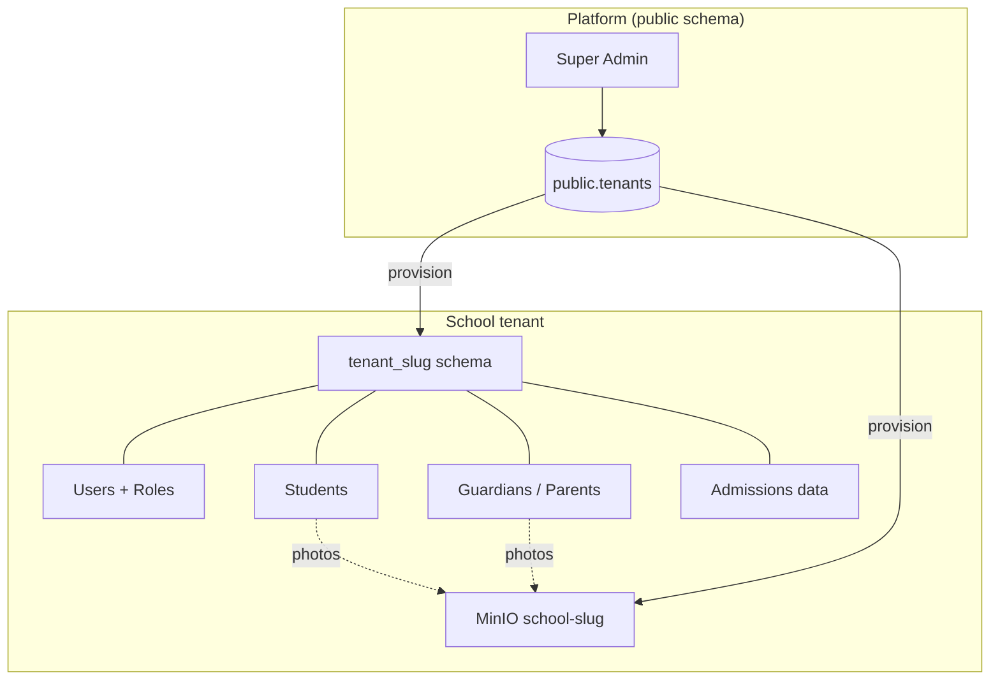
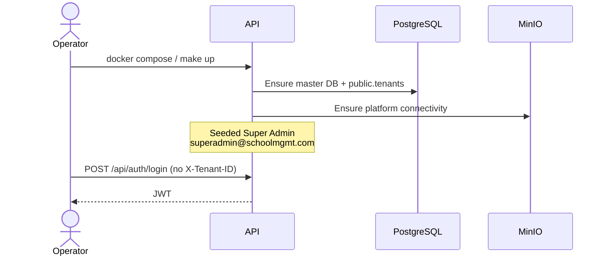
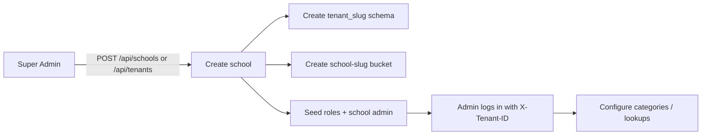
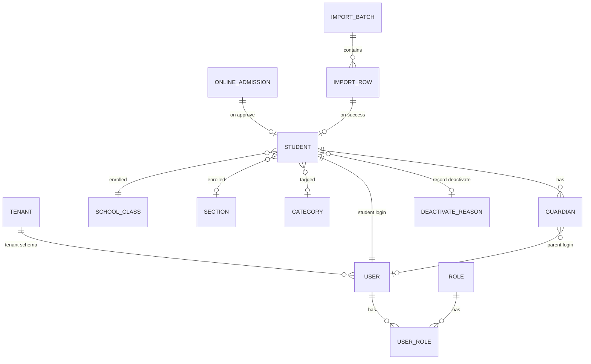

# System workflow (current)

> **Living document.** This describes the **currently implemented** end-to-end flow.
> When new modules ship, update this file and the [module index](./MODULES.md).

**Last updated:** 2026-08-09 · Modules 1–17 (Auth → Exam Master)

---

## 1. Big picture



| Layer | What exists today |
|-------|-------------------|
| Platform | Super Admin auth, create/list schools & tenants, logos, settings, stats |
| Tenant data | Users, roles, classes, sections, categories, students, guardians, employees, departments, designations, online applications, import batches |
| Storage | Per-school MinIO bucket; student/guardian/employee/import objects + presigned URLs |
| Student lifecycle | Admission · Online admit · CSV import · List · Deactivate · Login deactivate |
| Parent lifecycle | Auto from admission · Standalone add · List · Login deactivate |
| Employee lifecycle | Departments · Designations · Add/import staff · Role-tab list · Login deactivate |
| Payroll | Salary templates · Assign grades · Monthly payment · My salary slip |
| HR requests | Advance salary · Leave categories · Leave applications · Awards |
| Academic | Classes · Sections · Subjects · Class teachers · Timetable · Promotion |
| Exam Master | Terms · Halls · Mark distributions · Exam setup · Schedules · Mark entries |

---

## 2. Bootstrap workflow (once per deployment)



**Steps**

1. Start stack (`make up` or local API + postgres/minio).
2. Open Swagger → login as Super Admin.
3. Create schools (next section).

---

## 3. School provisioning workflow



**After create**

| Artifact | Name pattern |
|----------|----------------|
| DB schema | `tenant_{slug}` |
| MinIO bucket | `school-{slug}` |
| Header for school APIs | `X-Tenant-ID: {slug}` |

School Admin (and later teachers/parents/students) always send **Bearer token + X-Tenant-ID**.

---

## 4. Overall operational flow (implemented)

```mermaid
flowchart TD
  START([School Admin in tenant]) --> PREP[Prepare masters]

  PREP --> CAT[Student Categories]
  PREP --> LOOK[Admission lookups<br/>class / section / hostel / transport]

  CAT --> INGEST{How do students enter?}
  LOOK --> INGEST

  INGEST -->|Form| ADM[Student Admission<br/>/api/admission]
  INGEST -->|CSV| IMP[Student Import<br/>/api/student-import]
  INGEST -->|Public form| ONL[Online Admission<br/>/api/online-admission]
  ONL -->|Approve| ADM2[Creates student + users]
  ADM --> DIR
  IMP --> DIR
  ADM2 --> DIR

  DIR[Student List<br/>/api/student-list]

  DIR --> LIFE{Student lifecycle}
  LIFE --> EDIT[View / Edit / Photo]
  LIFE --> EXP[Export csv/excel/pdf]
  LIFE --> BULK[Bulk soft delete]
  LIFE --> LGN[Toggle login]
  LIFE --> DEACT[Deactivate record + reason]

  DEACT --> REAS[Deactivate Reason master<br/>/api/deactivate-reasons]
  LGN --> SLGN[Student Login Deactivate<br/>/api/login-deactivate]
  SLGN -->|Bulk Authentication Activate| DIR

  DIR --> PAR[Parents list<br/>/api/parents]
  ADM --> PAR
  PAR --> PADD[Add standalone parent<br/>+ social / alternative fields]
  PAR --> PME[Parent /api/parents/me]
  PAR --> PLGN[Parent Login Deactivate<br/>/api/parent-login-deactivate]
  PLGN -->|Bulk activate| PAR

  START --> EMPPREP[Employee masters]
  EMPPREP --> DEPT[/api/departments]
  EMPPREP --> DESG[/api/designations]
  DEPT --> EMP[Employees<br/>/api/employees]
  DESG --> EMP
  EMP --> EMPLIST[List by role tab]
  EMP --> EMPIMP[CSV import]
  EMP --> EMPLGN[Employee Login Deactivate<br/>/api/employee-login-deactivate]
  EMP --> PAY[Payroll<br/>/api/payroll]
  PAY --> TPL[Salary templates]
  PAY --> ASN[Salary assign]
  PAY --> PAYM[Salary payment]
  EMP --> ADV[Advance salary<br/>/api/advance-salary]
  EMP --> LEAVE[Leave<br/>/api/leave]
  EMP --> AWD[Awards<br/>/api/awards]
  DIR --> AWD
  START --> ACAD[Academic<br/>/api/academic]
  ACAD --> CLS[Classes / sections / subjects]
  ACAD --> TIM[Schedules + class teachers]
  DIR --> PROM[Student promotion]
  ACAD --> EXAM[Exam Master<br/>/api/exam]
  EXAM --> EXS[Setup + schedules]
  EXS --> MARKS[Mark entries]
  ADV --> PAYM
```

---

## 5. Actor journeys (current)

### Super Admin

1. Login (no tenant header).
2. Create / activate / deactivate schools.
3. Upload logos, edit settings, view stats, export school list.
4. Optionally operate inside a school with `X-Tenant-ID`.

### School Admin

1. Login with `X-Tenant-ID`.
2. Maintain categories and use admission lookups.
3. Enroll students (admission / import / approve online apps).
4. Manage Student List (filter by class, search, export, deactivate).
5. Maintain deactivate reason labels.
6. Manage student & parent login deactivate queues.
7. Manage parents (add, photo, soft delete with sole-guardian guard).
8. Maintain departments / designations; add or CSV-import employees; manage employee login deactivate.
9. Manage payroll: salary templates, assign grades, process monthly payments (also Accountant).
10. Manage advance salary (also Accountant) and leave categories / applications.
11. Give awards to employees or students (also Accountant).
12. Manage academic structure (classes, sections, subjects, class teachers, schedules) and student promotion.
13. Manage exams: terms, halls, mark distributions, exam setup/publish, schedules, mark entries.

### Teacher

1. Read access: admissions list/detail, online admissions, student list, categories, parents list/detail.
2. Own employee profile: `GET /api/employees/me`.
3. Own salary: `GET /api/payroll/my-salary` (+ month slip).
4. Own HR: `/api/advance-salary/my`, `/api/leave/my`, `/api/awards/my`.
5. Academic: read subjects/schedules; own teacher schedule.
6. Exams: read schedules; submit mark entries.
7. No write on deactivate / import / parent or employee create (admin-only).

### Parent (Guardian)

1. Login with tenant header.
2. `GET /api/parents/me` — own profile + linked students.
3. View ward student details where authorized.

### Student

1. Login with tenant header.
2. `GET /api/student-list/me` — own profile.
3. Limited admission/list read of self.
4. Published exam schedules (`/api/exam/schedules`) and own marks when result is published.

### Public applicant

1. Load classes for school slug.
2. Submit online admission → track by reference number.
3. Waits for admin approve/decline/payment.

---

## 6. Data relationships (simplified)



---

## 7. Module map ↔ workflow stage

| Stage | Modules | Docs |
|-------|---------|------|
| Identity | Auth | [01-auth](./modules/01-auth.md) |
| Onboard school | Tenants & Schools | [02-tenants-schools](./modules/02-tenants-schools.md) |
| Masters | Categories, Lookups | [06](./modules/06-student-categories.md), [03](./modules/03-student-admission.md) |
| Ingest students | Admission, Online, Import | [03](./modules/03-student-admission.md), [04](./modules/04-online-admission.md), [05](./modules/05-student-import.md) |
| Operate directory | Student List | [07](./modules/07-student-list.md) |
| Exit / hold | Deactivate reasons, Login deactivate | [08](./modules/08-deactivate-reasons.md), [09](./modules/09-login-deactivate.md) |
| Family | Parents, Parent login deactivate | [10](./modules/10-parents.md), [11](./modules/11-parent-login-deactivate.md) |

---

## 8. Not implemented yet (placeholders for future updates)

When these land, extend the diagrams above and add module docs:

| Area | Examples (planned / not in API yet) |
|------|-------------------------------------|
| Academics | Attendance, homework, report cards (exams: see module 17) |
| Fees | Fee structure, invoices, payments ledger, receipts |
| HR | Teachers staff CRUD beyond roles, payroll |
| Library / Inventory | Books, issue/return, assets |
| Transport ops | Live routes beyond lookup seed |
| Hostel ops | Allocation workflows beyond lookup |
| Messaging | SMS/email notifications, announcements |
| Analytics | Dashboards beyond school stats |
| Mobile apps | Dedicated client apps |

**Update checklist when adding a feature**

1. Add `docs/modules/NN-name.md`
2. Link it in [`MODULES.md`](./MODULES.md)
3. Add a box/arrow in **§4 Overall operational flow**
4. Add actor steps in **§5** if a new role is involved
5. Bump **Last updated** at the top of this file
6. Mention the feature in root `README.md` Features table

---

## 9. Quick command reference

```bash
cd SchoolManagement
make pull && make up          # full stack
# API:    http://localhost:5000/swagger
# MinIO:  http://localhost:9001
```

Headers for school work:

```http
Authorization: Bearer {access_token}
X-Tenant-ID: {school-slug}
```
